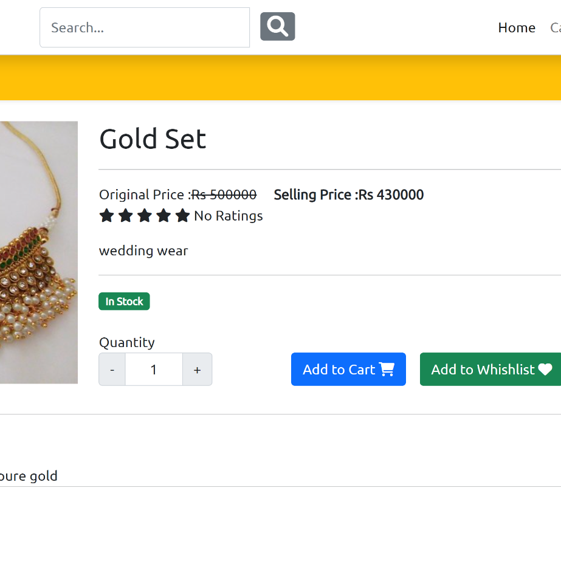
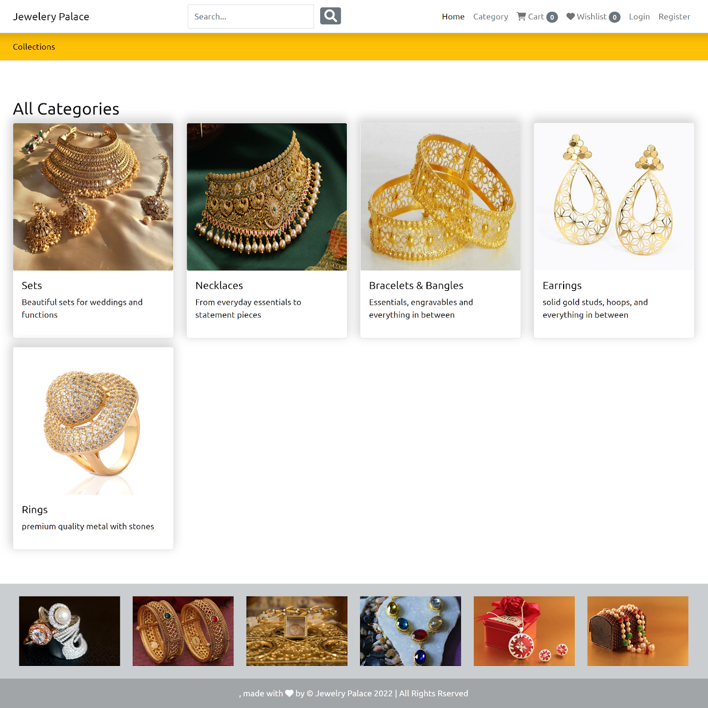
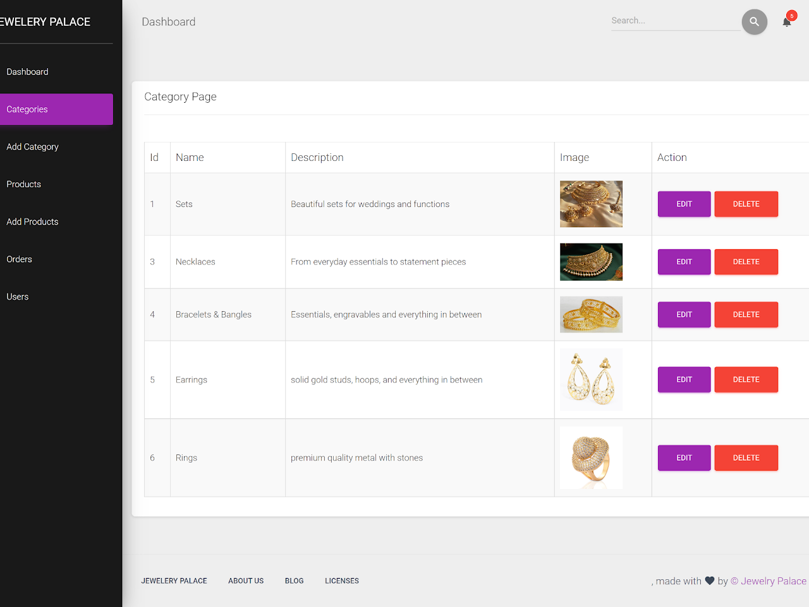

# 💍 JewelConnect - Empowering Local Jewellers


> A vibrant e-commerce platform built to uplift **local jewellery businesses** by providing them with modern tools to **showcase, sell, and scale** their stunning creations online.

---

## ✨ Features

- 🛒 **Custom Online Stores** for individual jewellers
- 📦 **Product Catalog Management** with images, pricing, and descriptions
- 💳 **Secure Checkout** with multiple payment options
- 📱 **Mobile-First UI** for customers and vendors
- 🔍 **Advanced Search & Filtering** by price, metal, stone, and design
- 📈 **Dashboard for Sales Analytics**
- 📬 **Order Tracking and Notifications**

---

## 🚀 Tech Stack

| Frontend        | Backend        | Database       | Other             |
|----------------|----------------|----------------|-------------------|
| React.js (TS)   | Node.js / Express | PostgreSQL     | Stripe API, JWT Auth |
| Tailwind CSS   | REST APIs       | Prisma ORM     | Cloudinary (for image upload) |

---

## 📸 UI Previews

| Browse Products | Product Details |
|-----------------|-----------------|
|  |  |

| Seller Dashboard | Cart Summary |
|------------------|--------------|
|  |  |

---

## 💡 Why JewelConnect?

> “Most local jewellers struggle to digitize their business. JewelConnect bridges the gap by offering them a simple, customizable, and scalable solution to go online and thrive.”

---

## 🔧 Setup & Installation

1. **Clone the Repository**

```bash
git clone https://github.com/yourusername/jewelconnect.git
cd jewelconnect
